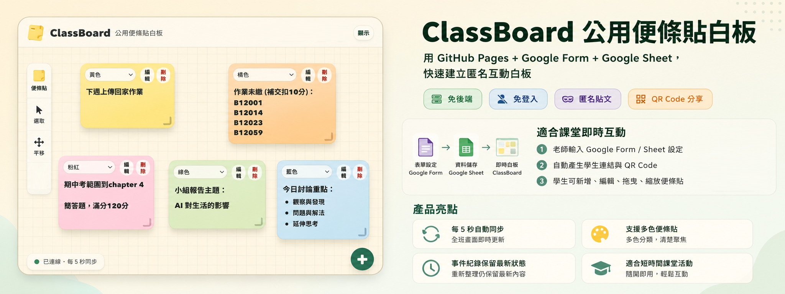

# 公用便條貼白板

提供一面全班都能即時查看的線上便條貼牆。上課時，學生可以透過手機、平板或電腦張貼自己的想法；老師則能運用這項工具進行腦力激盪、小組討論、議題引導與意見蒐集，鼓勵學生自由表達、彼此交流，並激發更多元的思考。

市面上雖然已有不少類似工具，但大多需要註冊帳號，免費版本也常有功能限制或廣告干擾。這套公用便條貼白板完全不需要註冊，也不會顯示廣告，只需使用老師自己的 Google Form 與 Google Sheet 作為資料儲存空間。

所有便條貼內容都會儲存在老師自己的 Google Sheet 中，本網站不會另外保存老師或學生的資料，讓課堂互動更簡單，也更重視使用者的隱私。

## 線上使用

- 直接使用的 demo 試玩版網址：https://educatres.github.io/classboard/demo.html
- 直接使用的網址：https://educatres.github.io/classboard/index.html



## 功能

- 可直接試玩的展示頁：`demo.html`，資料保存在瀏覽器 localStorage。
- 老師設定頁：輸入 Google Sheet、Google Form 與欄位 entry ID。
- 產生學生白板連結與 QR Code。
- 學生白板頁：新增、編輯、拖曳、縮放、刪除便條貼。
- 便條貼顏色：yellow、pink、blue、green、purple、orange。
- 每 5 秒自動同步一次，也可以手動重新同步。
- 使用 event log 模式，同一張便條貼只顯示最新狀態，`delete` / `hide` 事件會隱藏便條貼。
- 工具列可「清除所有」便條貼，實作方式是把目前便條貼新增 `hide` 狀態事件，不會刪除既有資料列。

## 檔案結構

```text
.
├── index.html
├── demo.html
├── board.html
├── css/
│   └── styles.css
├── js/
│   ├── board.js
│   ├── config.js
│   ├── demo.js
│   ├── google-form.js
│   ├── google-sheet.js
│   ├── index.js
│   ├── note-store.js
│   └── qr.js
└── github-pages-google-sheet-sticky-board-spec.md
```

## Google Form 欄位

請建立一份 Google Form，欄位建議依序如下：

| 欄位名稱 | 類型 |
| --- | --- |
| board_id | 簡答 |
| note_id | 簡答 |
| action | 簡答 |
| text | 段落 |
| x | 簡答 |
| y | 簡答 |
| width | 簡答 |
| height | 簡答 |
| color | 簡答 |
| z_index | 簡答 |
| timestamp_client | 簡答 |

Google Form 送出後，請將回應連結到 Google Sheet。

## 最簡單取得 entry ID

每個 Google Form 欄位都會有一個 `entry.xxxxx`。設定頁支援從預填連結自動帶入，不需要逐格手填：

1. 打開 Google Form。
2. 使用「取得預填連結」。
3. 每個欄位填入對應欄位名稱，例如 `board_id`、`note_id`、`action`、`text`。
4. 複製產生的預填連結。
5. 貼到設定頁 Step 2，按「從預填連結自動帶入」。

如果自動帶入失敗，也可以展開「進階：手動檢查或修改 entry ID」自行填入。

## Google Sheet 權限

請將 Google Sheet 設定為：

```text
知道連結的人可以檢視
```

前端會用以下其中一種方式讀取資料：

- 有填 Sheet 名稱時：Google Visualization API。
- 沒填 Sheet 名稱但有填 gid 時：CSV export。
- 兩者都沒填時：預設嘗試讀取 `表單回應 1`。

## Form URL

Google Form 寫入 endpoint 通常長這樣：

```text
https://docs.google.com/forms/d/e/{FORM_ID}/formResponse
```

如果貼上 `/viewform` 或 `/edit`，設定頁會自動嘗試轉成 `/formResponse`。

## 本機預覽

可以用任何靜態伺服器預覽，例如：

```bash
python3 -m http.server 8080
```

然後開啟：

```text
http://localhost:8080/
```

## 部署到 GitHub Pages

1. 將本專案推到 GitHub repository。
2. 到 repository 的 Settings。
3. 開啟 Pages。
4. Source 選擇 `Deploy from a branch`。
5. Branch 選擇 `main` 或你的部署分支。
6. Folder 選擇 `/root`。
7. 儲存後等待 GitHub Pages 建置完成。

## 重要限制與風險

- 本工具不做登入與權限控管。
- 請勿收集姓名、學號、電話、Email 或任何個資。
- 公開 Google Sheet 代表知道連結的人可能讀取資料。
- Google Form URL 若外流，可能被惡意送出資料。
- `no-cors` 寫入無法由前端確認是否真的成功，需以後續同步結果判斷。
- 適合短時間課堂活動，不適合作為正式或敏感資料收集系統。

## 授權

本專案採用 MIT License。

## URL 參數

白板頁使用 query string 保存設定，格式如下：

```text
board.html?board_id=...&sheet_id=...&sheet_name=...&gid=...&form_url=...&field_board_id=entry.xxxx&...
```

必要欄位包含：

- `board_id`
- `sheet_id`
- `form_url`
- `field_board_id`
- `field_note_id`
- `field_action`
- `field_text`
- `field_x`
- `field_y`
- `field_width`
- `field_height`
- `field_color`
- `field_z_index`
- `field_timestamp_client`
